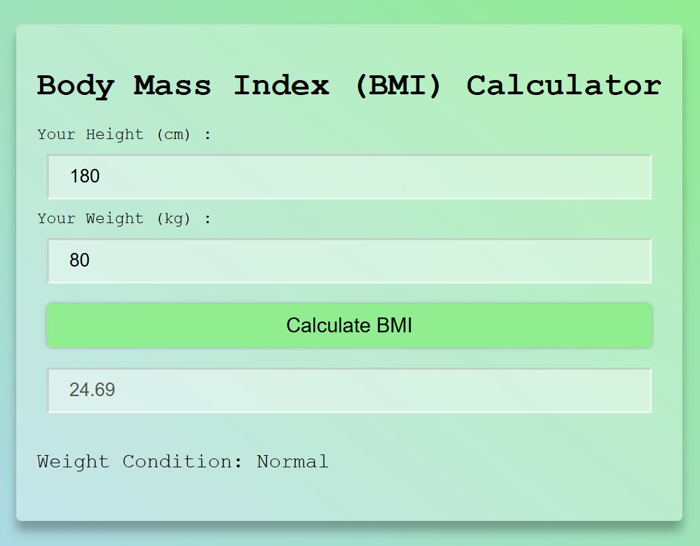

# BMI Calculator 💪📊  

A simple and user-friendly **Body Mass Index (BMI) Calculator** built using HTML/CSS/JavaScript. This tool helps users quickly determine their BMI based on their weight and height and provides health category insights.  

## 🚀 Features  
- ✅ Calculate BMI based on weight (kg/lbs) and height (cm/ft)  
- ✅ Display BMI category (Underweight, Normal, Overweight, Obese)  
- ✅ Responsive and intuitive UI  
- ✅ Lightweight and fast performance  

## 🛠 Tech Stack  
HTML, CSS, JavaScript

## 📷 Screenshots  

## 📌 How to Use  
1. Enter your weight and height.  
2. Click on the "Calculate" button.  
3. View your BMI value and health category.  

## 🎯 Future Enhancements  
- 📊 Add BMI chart visualization  
- 🌍 Support for multiple measurement units (Metric & Imperial)  
- 📈 Save and track BMI history  

---

